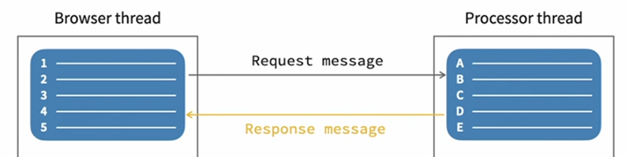
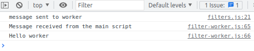

# JavaScript: Async

Notes on the linkedin learning course of the same name by Sasha Vodnik

## classic async XMLHttpRequest with callbacks

    // add global variable containing XHR object here
    let httpRequest = new XMLHttpRequest();

    function get(url, success, fail) {
        httpRequest.open('GET', url);
        httpRequest.onload = function () {
            switch (httpRequest.status) {
                case 200:
                    success(httpRequest.responseText);
                    break;
                default:
                    fail(httpRequest.status);
                    
            }
        };
        httpRequest.send();
    }

    function failHandler(status) {
        console.log(`Failed with code ${status}`);
    }
    
    function successHandler(data) {
        const dataObj = JSON.parse(data);
        // do something with the data
    }
    
    document.addEventListener('DOMContentLoaded', function() {
        const apiKey = '...'; 
        const url = 'https://api.openweathermap.org/data/2.5/weather?q=2911298&APPID=' + apiKey;
        get(url, successHandler, failHandler);
    });

Problem: multiple chained / nested callbacks makes code hard to read.

## Async with promises and fetch

### Promises

#### Basics

A promise is an object that *represents* the *eventual* result of an asynchronous operation. It contains information about the operation and tracks its status:

    state: "pending" | "fulfilled" | "rejected"
    result: undefined (starts with undefined) | value (based on operation)

When the operation is complete, it executes one of two methods depending on the result when it is complete:

    resolve(value) if operation was succesful
    reject(error) if the operation failed

Basic setup:

    let promise = new Promise(function(resolve, reject) {
        // do something
        if(/*everything worked*/) {
            resolve(result);
        else {
            reject(error);
    });

Promises can be used for anything, but are most useful for asynchronous tasks.

#### then, catch and finally

Promises allow multiple additional methods to be chained to the code that calls the original promise using `then`. 
If a promise fails (is rejected), it can be caught with `catch`.
With `finally`, a callback can be specified that gets executed no matter if the promise was resolved or rejected. This can be useful for code that is used both resolve or reject callbacks.

    promise.
        .then(function(result) {
            // do something with the result and assign to newResult
            // e.g. let newResult = JSON.parse(result);
            return newResult;
        })
        .then(function(newResult) {
            // do something with newResult and assign to finalResult
            return finalResult;
        })
        .catch(function(error) {
            console.log(error);
        })
        .finally(function(result) {
            // repetitive code here
        });

Full example:

    function get(url) {
        return new Promise(function (resolve, reject) {
            let httpRequest = new XMLHttpRequest();
            httpRequest.open('GET', url);
            httpRequest.onload = function () {
                if (httpRequest.status === 200) {
                    resolve(httpRequest.responseText);
                } else {
                    reject(Error(httpRequest.status));
                }
            }
            // Handle network errors
            httpRequest.onerror = function () {
                reject(Error('Network Error'));
            };
    
            httpRequest.send();
        });
    };
    
    function successHandler(data) {
        const dataObj = JSON.parse(data);
        const weatherDiv = document.querySelector('#weather');
        const weatherFragment = `
            <h1>Weather</h1>
            <h2 class="top">
            ${dataObj.name}
            </h2>
            

            ${tempToF(dataObj.main.temp)}&deg; | ${dataObj.weather[0].description}
            

        `
        weatherDiv.innerHTML = weatherFragment;
    }
    
    function failHandler(status) {
        console.log(status);
    }
    
    function tempToF(kelvin) {
        return ((kelvin - 273.15) * 1.8 + 32).toFixed(0);
    }
    
    document.addEventListener('DOMContentLoaded', function () {
        const apiKey = 'bb84a3f47203ddfb8e5c300424eb56be';
        const url = 'https://api.openweathermap.org/data/2.5/weather?q=los+angeles&APPID=' + apiKey;
        get(url)
            .then(function (result) {
                successHandler(result)
            })
            .catch(function (status) {
                failHandler(status);
            })
            .finally(function(result) {
                const weatherDiv = document.querySelector('#weather');
                weatherDiv.classList.remove('hidden');
            });
    });

#### multiple promises using the "all" method

Promises include an `all` method that takes an array containing multiple promises that moves on the then / catch methods only when all promises are finished. It returns an array of results from the promises it was passed.

The same example as above with the weather for multiple cities:

    function get(url) {
        // ...same as before
    }
    
    function successHandler(data) {
        const dataObj = JSON.parse(data);
        const div = `
            <h2 class="top">
            // ...same as before
        `;
        return div;
    }
    
    // ...

    document.addEventListener('DOMContentLoaded', function () {
        const apiKey = '...';
        const weatherDiv = document.querySelector('#weather');
        const urls = ['los+angeles,us', 'san+francisco,us', 'mariposa,us'].map(
            location => `https://api.openweathermap.org/data/2.5/weather?q=${location}&APPID=${apiKey}`
        );
        Promise.all([get(urls[0]), get(urls[1]), get(urls[2])])
            .then(function (responses) {
                return responses.map(response => successHandler(response));
            })
            .then(function(divs) {
                weatherDiv.innerHTML = `<h1>weather</h1>${divs.join()}`;
            })
            .catch(function (status) {
                failHandler(status);
            })
            .finally(function () {
                weatherDiv.classList.remove('hidden');
            });
    });

Promises are available in all major browsers except IE 11 and below and opera mini ;mostly used in african and other countries with very expensive data plans. It can be polyfilled.

### Fetch

The [fetch API](https://developer.mozilla.org/en-US/docs/Web/API/Fetch_API) creates an asynchronous HTTP request with a syntax that's based on promises 

## Async / await

As an alternative to the promise based syntax, `async` / `await` was introduced to make working with asynchronous data even easier.

`async` is prepended to a function to indicate to the interpreter that the function should be executed asynchronously (it should not block the parsers main process).

*Within* an asynchronous function, you use the `await` keyword in front of statements that returns a promise to indicate that the function should stop and wait for the result before proceeding.

`async` / `await` are **syntactic sugar** for promises.

    async function() {
        let data = await getData();
        let formattedData = await formatData(data);
        return formattedData;
    }

is equivalent to (both examples are incomplete):

    promise
    .then(function(result) {
        return getData(result);
    })
    .then(function(newResult) {
        return formatData(newResult);
    });

Async / await have no special error handling like `failhandler` or `.catch` but instead can be used with the standard `try` / `catch`.

    // everything else stays the same
    document.addEventListener('DOMContentLoaded', function () {
        const apiKey = '...'; // ADD YOUR API KEY BETWEEN THE QUOTES
        //const apiKey = '';
        const weatherDiv = document.querySelector('#weather');
    
        const locations = [
            'los+angeles,us',
            'san+francisco,us',
            'lone+pine,us',
            'mariposa,us'
        ];
        const urls = locations.map(function (location) {
            return `https://api.openweathermap.org/data/2.5/weather?q=${location}&APPID=${apiKey}`;
        });
    
        (async function () {
    
            try {
                const responses = [];
                // these run in parallel as the responses array gets a PROMISE object 
                // that resolves eventually
                // it would be different if the statments began with await, in which case
                // the loop would wait until it is resolved
                // note: when using foreach or map, these run in parallel in any case as 
                // foreach, map etc. run asynchronous over all iterable entries by default
                for (let i = 0; i < urls.length; i++) {
                    responses.push(await get(urls[i]));
                }
                // this is synchronous code again which is executed only when all
                // promises are resolved 
                let divs = responses.map(response => successHandler(response));
                weatherDiv.innerHTML = `<h1>Weather</h1>${divs.join('')}`;
            } catch (status) {
                failHandler(status);
            } finally {
                weatherDiv.classList.remove('hidden');
            }
            weatherDiv.classList.remove('hidden');
        })();
    });

`async` / `await` is available in all major browsers except IE 11 and below and opera mini ;mostly used in african and other countries with very expensive data plans. It can NOT be simply polyfilled but only be transpiled by babel or similar transpilers.

## Programming asynchronously with web workers

In the "traditional" javascript asynchronous model asynchronous tasks are still executed in one - the main - thread. Newer browsers support multiple threads in various ways, including *web workers* which enable to specify code in its own thread.

This frees up the browser thread from time intensive tasks, keeping the page responsive.

The browser communicates with the web worker by messages using `postMessage` in both the main thread script and the webworker script.

Web workers, as they run in their own processor thread, don't have access to the DOM.

### Basic example:

The calling script (the one that runs in the main thread as usual):

    const worker = new Worker('worker.js');
    worker.postMessage('Hello worker');

In the webworker script file, `this` can be used at the top level for communication:

worker.js:

    this.addEventListener('message', function (e) {
        console.log("Message received from the main script");
        console.log(e.data);
    });

More "realistic" example:

mainscript.js:

    const worker = new Worker('worker.js');

    document.querySelector('#threshold').addEventListener('click', function() {
        selectedFilter = 'threshold';
        const imageDataObj = getImageData(image);
        range.max = 255;
        range.value = 127;
        const level = Number(range.value);
        // BEFORE putting the image processing in the web worker:
        // const results = applyFilter(selectedFilter, level, imageDataObj);
        
        // we will move this in the eventlistener that receives messages
        // back from the webworker
        // displayFilteredImage(ctx, results); 

        // AFTER:
        worker.postMessage({
          filter: selectedFilter,
          level: level,
          image: imageDataObj
        });
        slider.classList.remove('hidden');
    });

    // receive and use the webworker result    
    worker.addEventListener('message', function(e) {
        displayFilteredImage(ctx, e.data);
    });

filter-worker.js:

    const applyFilter = (filter, level, image) => {
        // ...do time intensive stuff
        return results;
    };

    this.addEventListener('message', function (e) {
        const workerResult = applyFilter(   e.data.filter,
                                            e.data.level,
                                            e.data.image);
        postMessage(workerResult);
    });

Web workers were initially developed for using shared resources (**shared web workers**), but this use case is not widely supported and even removed again by browsers.

A **service worker** is used to decouple the main thread from network related tasks like server requests.

A **web socket** maintains a persistent connection with the server and updates the main app with results. **Web sockets** don't run in their own thread and thus HAVE access to the DOM.